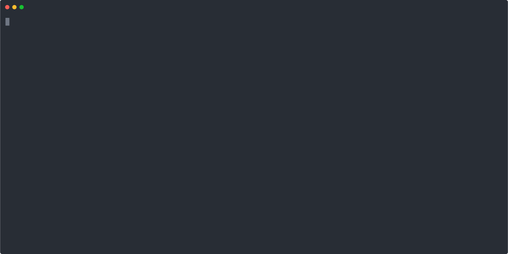

<div align="center">


	
# BlazorLocalization

Your users see text in their language. Always.

A drop-in replacement for `AddLocalization()` — any `IStringLocalizer` project, without `.resx` files

[](https://opensource.org/licenses/MIT)
[](https://www.nuget.org/packages/BlazorLocalization.Extensions)

</div>

Inline translations · Pluggable providers · Plurals & ordinals · Over-the-air updates · Distributed caching

---

## Quick Start

**1. Install:**

```bash
dotnet add package BlazorLocalization.Extensions
```

**2. Register in `Program.cs`:**

```csharp
// Replaces the built-in services.AddLocalization():
builder.Services.AddProviderBasedLocalization();
```

**3. Use in your code:**

```razor
@inject IStringLocalizer<Home> Loc

<h1>@Loc.Translation("Home.Title", "Welcome to our app")</h1>

<p>@(Loc.Translation("Home.Greeting", "Hello, {Name}!", new { Name = user.Name })
    .For("da", "Hej, {Name}!")
    .For("de", "Hallo, {Name}!"))</p>
```

Your source text is always the fallback — users never see blank strings or raw keys. `.For()` adds inline translations for other languages right where you write the text.

See [Examples](docs/Examples.md) for plurals, ordinals, enum display names, and more.

> **Note:** You still need `UseRequestLocalization()` middleware for culture detection — see [Configuration](docs/Configuration.md).

---

## Packages

| Package | Version | Install |
|---------|:-------:|--------:|
| [**BlazorLocalization.Extensions**](https://www.nuget.org/packages/BlazorLocalization.Extensions) <br/> Runtime library — cache-backed `IStringLocalizer` with plural support and pluggable translation providers | [](https://www.nuget.org/packages/BlazorLocalization.Extensions) | `dotnet add package BlazorLocalization.Extensions` |
| [**BlazorLocalization.Extractor**](https://www.nuget.org/packages/BlazorLocalization.Extractor) <br/> CLI tool (`blazor-loc`) — Roslyn-based scanner that extracts source strings from `.razor`, `.cs`, and `.resx` files | [](https://www.nuget.org/packages/BlazorLocalization.Extractor) | `dotnet tool install -g BlazorLocalization.Extractor` |

Translation providers:

| Package | Version | Install |
|---------|:-------:|--------:|
| [**BlazorLocalization.TranslationProvider.Crowdin**](https://www.nuget.org/packages/BlazorLocalization.TranslationProvider.Crowdin) <br/> Fetch translations from [Crowdin](https://crowdin.com/) OTA CDN | [](https://www.nuget.org/packages/BlazorLocalization.TranslationProvider.Crowdin) | `dotnet add package BlazorLocalization.TranslationProvider.Crowdin` |
| **JsonFile** <br/> Load translations from flat JSON files on disk | Ships with Extensions | — |
| **PoFile** <br/> Load translations from GNU Gettext PO files | Ships with Extensions | — |

---

## Add a Provider

Translation providers are pluggable and optional. Use them when you have too many strings for inline `.For()`, or want to connect a translation management platform.

```csharp
// JSON files on disk (ships with Extensions — no extra package):
builder.Services.AddProviderBasedLocalization(builder.Configuration)
    .AddJsonFileTranslationProvider();
```

```csharp
// Or over-the-air from Crowdin CDN (separate package):
// Configure your distribution hash in appsettings.json — see Crowdin Provider docs
builder.Services.AddProviderBasedLocalization()
    .AddCrowdinTranslationProvider();
```

The provider always wins when it has a translation. Inline `.For()` translations serve as a starting point for translators and a runtime fallback.

See [Providers](docs/Configuration.md#translation-providers) for all available providers and their setup.

---

## Why BlazorLocalization?

[`IStringLocalizer`](https://learn.microsoft.com/en-us/aspnet/core/blazor/globalization-localization?view=aspnetcore-10.0) is deeply embedded in ASP.NET Core — Blazor, MVC, Razor Pages, APIs. BlazorLocalization keeps it as the interface but [replaces `AddLocalization()`](https://learn.microsoft.com/en-us/aspnet/core/fundamentals/localization-extensibility?view=aspnetcore-10.0) and its `ResourceManager` / `.resx` backend entirely:

- **Over-the-air translations** — FusionCache refreshes from your provider in the background. Change a translation, your app picks it up without redeployment
- **Source text fallback** — if translations haven't loaded yet, users see your source text, never blank strings or keys
- **CLDR plural support** — plural categories, ordinals, gender/select. ICU concepts, C# ergonomics
- **Distributed caching** — L1 memory out of the box, optional L2 via any `IDistributedCache` (Redis, SQLite, etc.)
- **Pluggable providers** — load translations from JSON files, Crowdin, a database, or any custom source. Stack multiple providers with fallback chains

**What you're leaving behind:** `.resx` merge conflicts, rebuild-and-redeploy for every text change, no plural support, no distributed caching.

Built on [Microsoft's `IStringLocalizer`](https://learn.microsoft.com/en-us/aspnet/core/fundamentals/localization-extensibility?view=aspnetcore-10.0), [FusionCache](https://github.com/ZiggyCreatures/FusionCache), and [SmartFormat.NET](https://github.com/axuno/SmartFormat).

---

## String Extraction

Already using `IStringLocalizer`? The Extractor scans your `.razor`, `.cs`, and `.resx` files and exports every translation string — no matter which localization backend you use.

```bash
dotnet tool install -g BlazorLocalization.Extractor

# Interactive wizard — run with no arguments
blazor-loc

# Or go direct
blazor-loc extract ./src -f po -o ./translations
```



Upload the generated files to Crowdin, Lokalise, or any translation management system.
See [Extractor CLI](docs/Extractor.md) for recipes, CI integration, and export formats.

---

## Comparison

| Feature | Built-in `.resx` | OrchardCore PO | **BlazorLocalization** |
|---------|:-------------------------:|:--------------:|:----------------------:|
| Over-the-air updates | ✗ | ✗ | ✓ |
| Distributed cache (Redis, etc.) | ✗ | ✗ | ✓ |
| Plural support | ✗ | ✓ | ✓ — CLDR 46, ordinals, select |
| Source text as fallback | ✗ | Key = text* | ✓ — separate key + source text |
| Named placeholders | ✗ | ✗ | ✓ — via SmartFormat |
| External provider support | ✗ | ✗ | ✓ — pluggable |
| Merge-conflict-free | ✗ — XML | ✗ — PO files | ✓ — with OTA providers. File-based providers are opt-in |
| Automated string extraction | Manual | Manual | Roslyn-based CLI |
| Standard `IStringLocalizer` | ✓ | ✓ | ✓ |
| Battle-tested | ✓ — 20+ years | ✓ | Production use, actively maintained |

\* OrchardCore uses the `IStringLocalizer` indexer key as both the lookup key and the source text. Updating the original text creates a new entry — existing translations are orphaned.

---

## Documentation

| Topic | Description |
|-------|-------------|
| [Examples](docs/Examples.md) | `Translation()` usage — simple, placeholders, plurals, ordinals, select, inline translations |
| [Extractor CLI](docs/Extractor.md) | Install, interactive wizard, common recipes, CI integration, export formats |
| [Configuration](docs/Configuration.md) | Cache settings, `appsettings.json` binding, multiple providers, code-only config |
| [Crowdin Provider](docs/Providers/Crowdin.md) | Crowdin OTA setup — distribution hash, export formats, error handling |
| [JSON File Provider](docs/Providers/JsonFile.md) | Load translations from flat JSON files on disk |
| [PO File Provider](docs/Providers/PoFile.md) | Load translations from GNU gettext PO files |
| [Samples](samples/) | Runnable Blazor Server and Web API projects with full setup |

---

## FAQ

**Can I load translations from a database?**
Yes. Implement `ITranslationProvider` — it's a single method:

```csharp
Task<string?> GetTranslationAsync(string culture, string key, CancellationToken ct);
```

Load from a database, an API, a CMS — anything. BlazorLocalization handles caching, fallback, and hot-swapping. See the built-in [JsonFile](docs/Providers/JsonFile.md) provider as a reference.

**Does this only work with Blazor?**
No. It works with anything that uses `IStringLocalizer` — Blazor Server, Blazor WASM, MVC, Razor Pages, Web APIs, minimal APIs. "Blazor" is in the name because that's where most developers first hit the `.resx` wall.

**Do I need a translation provider?**
No. `Translation("key", "source text")` works on its own for your default language. Add `.For()` when you need additional languages inline. When you're ready to connect a translation management platform or load from files, add a provider — Extensions ships with JSON file and PO file providers, and Crowdin is available as a separate package.

**Is this production-ready?**
It's used in production. Born from real frustration with `.resx` in a multilingual product. Actively maintained. If you find it useful, give it a ⭐.

---

## Contributing

Contributions welcome! Each package has a [CONTRIBUTING.md](src/BlazorLocalization.Extensions/CONTRIBUTING.md) with architecture decisions, coding patterns, and how to run tests.

Built a translation provider for a platform not yet covered? Consider submitting it as a package.

## License

[MIT](LICENSE)
